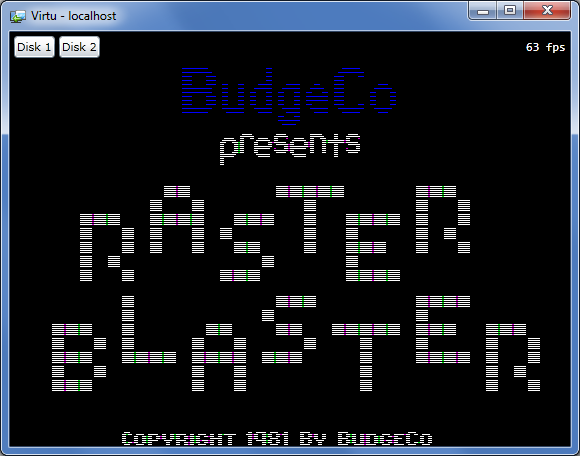
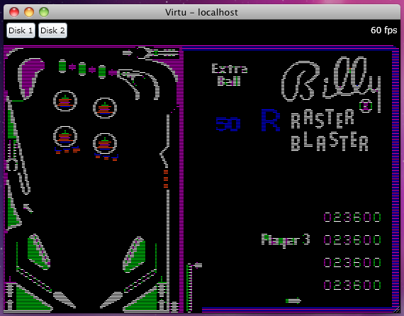
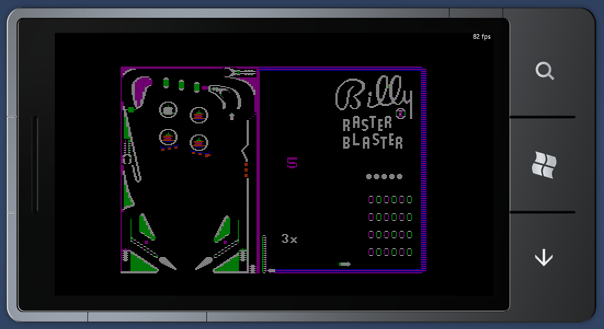

# Silverlight
Appealing due to its potential reach, but has been the most frustrating to use, probably due to bleeding edge, high expectations and the inevitable comparisons to WPF.

Pros:
* Mac OS X support.
* Linux support (Moonlight 3).
* Mobile support (Windows Phone 7).
* Dynamic sound buffer support.

Cons:
* Missing RenderOptions BitmapScalingMode (NearestNeighbor) for image scaling.
* Missing direct access to keyboard state.
* Missing caps lock key state from event handlers.
* Out of Browser mode cannot control the window and does not support caching framework extension assemblies.

I prefer running out of browser, but this mode has a few issues to work through. The key bindings are a little messy since the browser tends to hijack the keys I'd prefer to use and the lowest common denominator rules:

|Apple or Setting Key|Keyboard Binding|
|---|---|
|OpenApple|Alt or NumPad0|
|CloseApple|Windows or \[NumPad\]Decimal|
|Reset|Control+Back|
|CpuThrottle|Control+\[NumPad\]Divide|
|VideoMonochrome|Control+\[NumPad\]Multiply|
|VideoFullscreen|Control+\[NumPad\]Subtract (OOB)|

The UI is rudimentary but supports selecting local disk images at runtime.

# Screenshots

