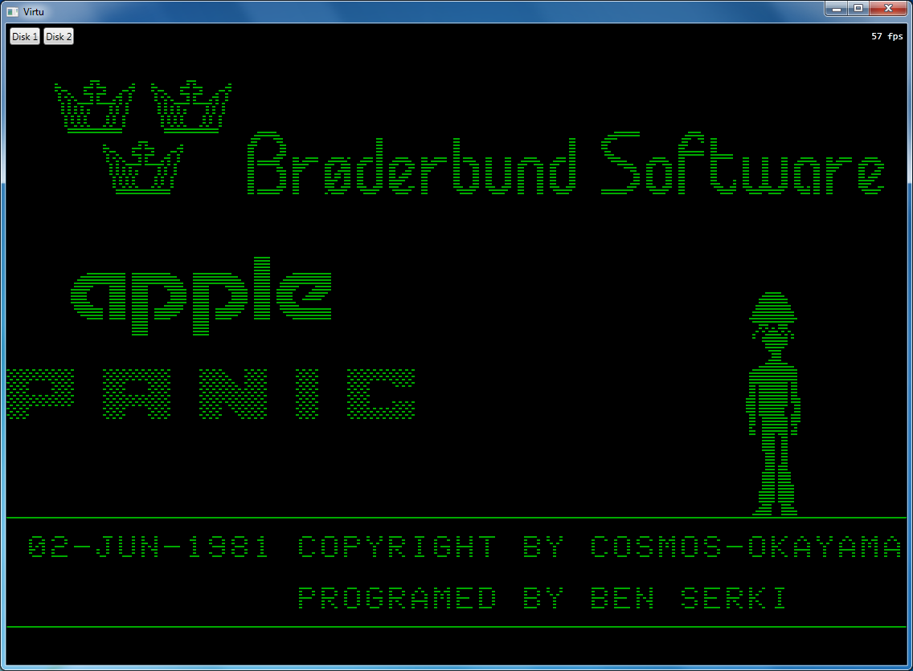
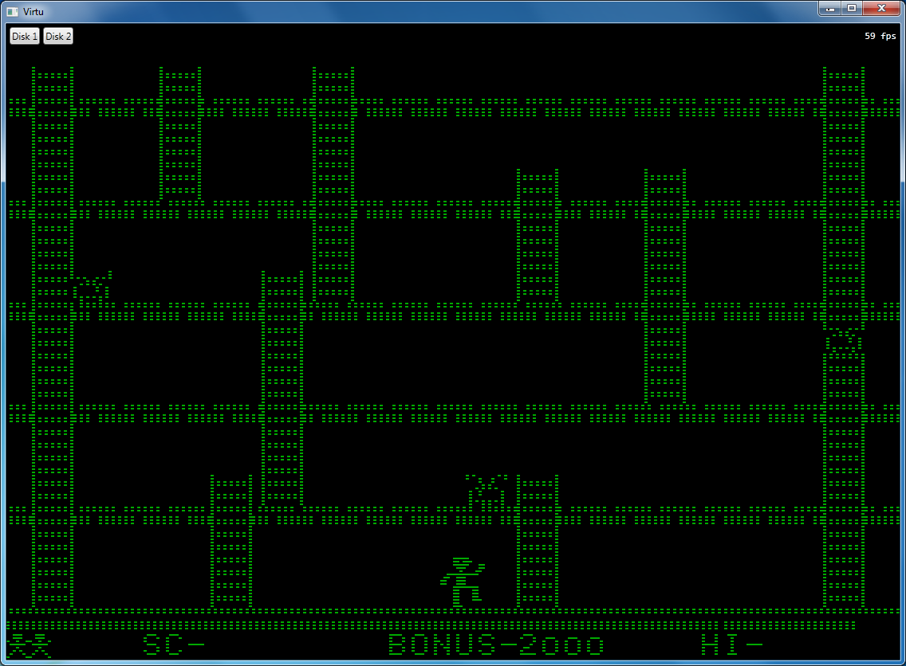

# WPF
Appealing due to its relative richness and maturity, but lacks the cross platform support of Silverlight.

Pros:
* Everything just works.

Cons:
* Missing dynamic sound buffer support (currently using interop to DirectSound).

Not much to complain about. The WPF implementation has become my default project since it can do everything without restriction and it's fast.

|Apple or Setting Key|Keyboard Binding|
|---|---|
|OpenApple|LeftAlt or NumPad0|
|CloseApple|RightAlt or \[NumPad\]Decimal|
|Reset|Control+Back|
|CpuThrottle|Control+\[NumPad\]Divide|
|VideoMonochrome|Control+\[NumPad\]Multiply|
|VideoFullscreen|Control+\[NumPad\]Subtract|

The UI is rudimentary but supports selecting disk images at runtime.

# Screenshots

