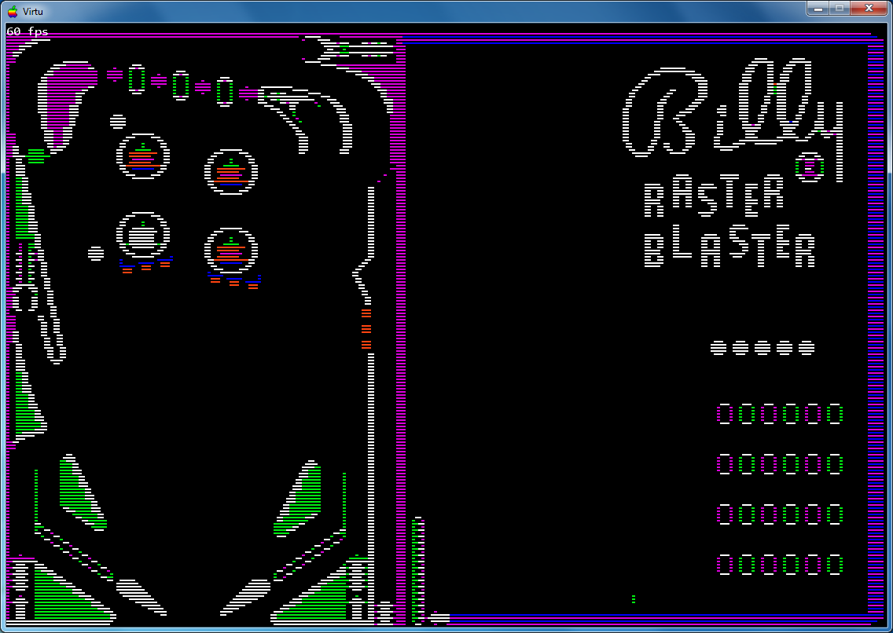
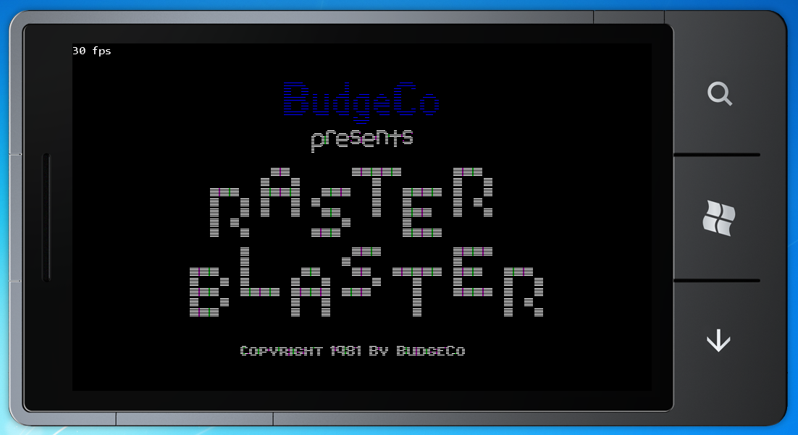
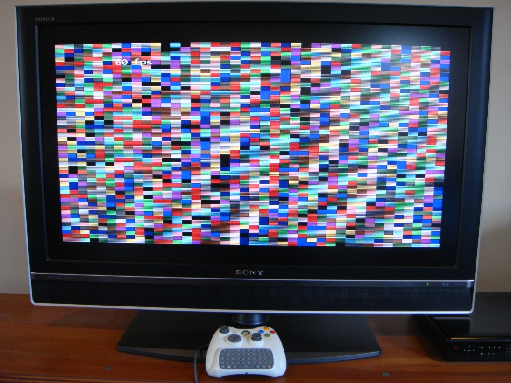

# XNA
Appealing due to its relative low level access and interesting cross platform support.

Pros:
* Xbox 360 support.
* Xbox 360 Controller on Windows.
* Xbox 360 Chatpad on Xbox 360.
* Windows Phone 7 support.

Cons:
* Missing buffered input support.
* Missing Xbox 360 Chatpad support on Windows.
* User interface will be a lot more work.

XNA is very impressive and a breeze to use compared to DirectX. Although low level compared to Silverlight and WPF, it doesn't go low enough sometimes and needs to surface more DirectX features.

|Apple or Setting Key|Keyboard Binding|Gamepad or Chatpad Binding|
|---|---|---|
|OpenApple|LeftAlt or NumPad0|LeftShoulder|
|CloseApple|RightAlt or \[NumPad\]Decimal|RightShoulder|
|Reset|Control+Back|LeftStick+Start|
|CpuThrottle|Control+\[NumPad\]Divide|LeftStick+D8|
|VideoMonochrome|Control+\[NumPad\]Multiply|LeftStick+D9|
|VideoFullscreen|Control+\[NumPad\]Subtract|LeftStick+D0|

The current implementation does not have any sound on Xbox 360. Also it does not support browsing for disk images.

# Screenshots

